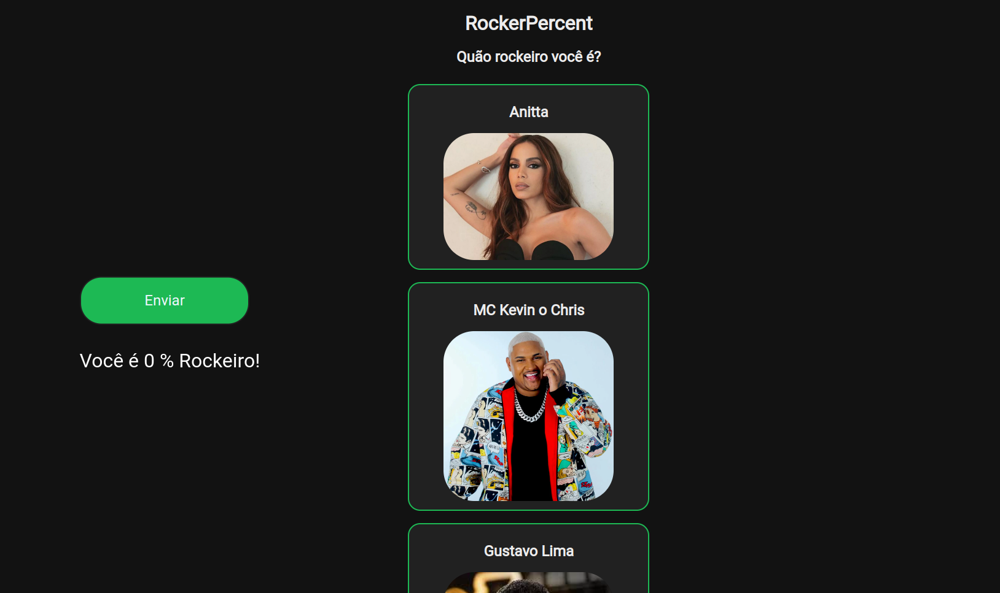

# RockerPercent

**Número da Lista**: 12<br>
**Conteúdo da Disciplina**: D&C <br>
## Alunos
|Matrícula | Aluno |
| -- | -- |
| 18/0119231  |  Eduardo Maia Rezende |
| 17/0107426  |  Kayro César Silva Machado |


## Sobre 
RockerPercent é uma aplicação que utiliza do algoritmo de contagem de inversões com a abordagem de dividir e conquistar para calcular o quão rockeiro você é. Para isso, o usuário deve ordenar uma lista de artistas de acordo com sua preferência musical, sendo os mais preferidos no topo e os menos preferidos em baixo. A partir disso, o algoritmo irá calcular o número de inversões que foram feitas e, com base nisso, irá calcular o quão rockeiro você é.

## Screenshots


## Instalação 
**Linguagem**: Python & Javascript< br>
**Framework**: Flask<br>

- Dependências:
  - Flask


### Passo 1:
 Caso não possua as dependências descritas acima, instale-as na pasta raiz do projeto utilizando comando abaixo:
```sh
pip3 install -r requirements.txt
```
### Passo 2:
Entre na pasta **src** do projeto e execute o arquivo principal  com o comando abaixo:
```
python3 app.py
```

## Uso

Acesse a porta 5000 a partir do link [http://127.0.0.1:5000/](http://127.0.0.1:5000/), ordene os artistas de acordo com seu preferência musical (mais preferidos no topo e menso preferidos em baixo) e clique em enviar para saber o quão rockeiro você é.


